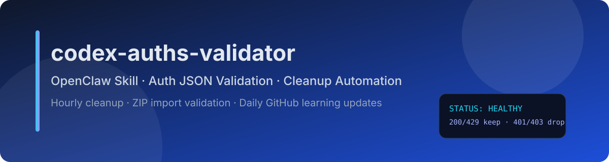

# skills-codex-auths-validator (English)

Chinese README: [README.md](./README.md)

---

**OpenClaw skill for auth JSON automation: hourly cleanup, ZIP/7z import validation, and daily GitHub learning checks.**

**Just provide the JSON directory path, and the skill handles everything automatically.**

If path is not provided, it assumes possible `Cli-Proxy-API-Management-Center` deployment and auto-discovers via `auth-dir` + Docker mount hints.

## Core capabilities (concise)

1. Multi-provider auto detection (qwen/kimi/gemini/claude/codex/vertex/...)
2. Codex remote validation + unified status model
3. **3-layer expiry detection**: JWT `exp` → `expired` field → `last_refresh`+7d; never discards blindly
4. **Auto token refresh**: uses `refresh_token` to renew expired tokens in-place, saving recoverable accounts
5. Dual-directory classification + invalid directory archive
6. **account_id deduplication**: keeps the quota-bearing account when duplicates exist
7. ZIP/7z import auto takeover (JSON only, non-JSON ignored)
8. Stable hourly reconcile (lock + transient keep + auto dedup + report auto-prune)
9. Daily learning check + daily skill self-sync

## Directory model

- `auths_dir` (valid with quota)
- `auths_no_quota_dir` (valid but no quota / 429)
- `auths_invalid_dir` (invalid files with explainable reasons)

## Script mapping

- `scripts/discover-auth-dir.mjs` (first-time path discovery)
- `scripts/validate-auths.mjs` (manual one-off batch)
- `scripts/hourly-reconcile.mjs` (hourly stable runner)
- `scripts/import-archive.mjs` (ZIP/7z JSON-only import takeover)

## Required scheduled jobs (Asia/Shanghai)

1. **Hourly validation cleanup (system crontab)**: `skills/codex-auths-validator/scripts/hourly-run-and-notify.sh`
2. Daily 00:00 GitHub learning check (OpenClaw cron, agentTurn)
3. Daily 00:00 skill self-sync (OpenClaw cron, agentTurn)
