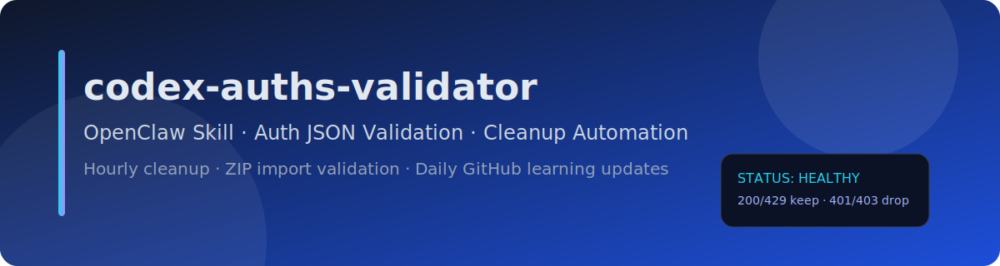
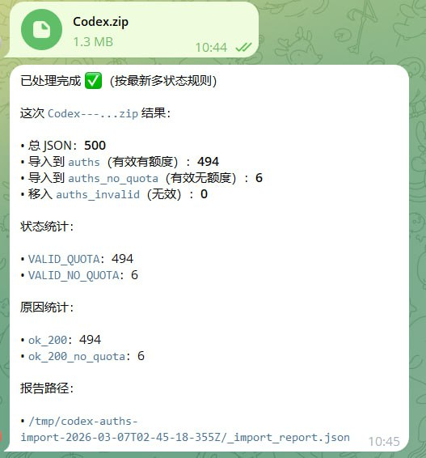
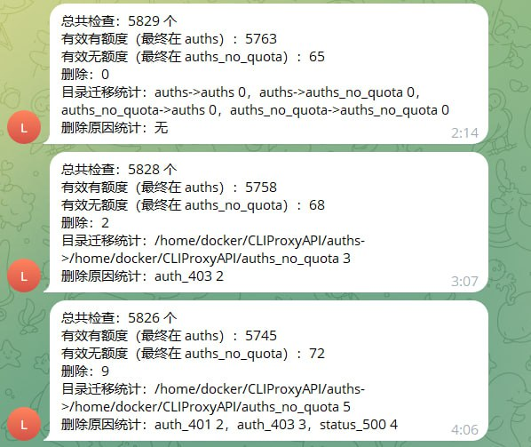

# skills-codex-auths-validator

## 一键复制使用（OpenClaw）

> 下面这段可以直接复制给 OpenClaw，让它学习本 skill、立刻执行一次，并创建全部定时任务。

```text
请安装并学习这个 skill：
https://github.com/LSH160981/skills-codex-auths-validator

要求你立即执行：
1) 拉取并学习 skills/codex-auths-validator 全部内容；
2) 自动探测（或让我指定）JSON 认证目录 auths_dir，并创建 auths_no_quota_dir 与 auths_invalid_dir；
3) 立刻执行一次全量校验与分层迁移；
4) 自动创建并启用全部定时任务（上海时区）：
   - 每小时自动校验清理（hourly-reconcile）
   - 每日 00:00 GitHub 学习巡检
   - 每日 00:00 Skill 同步
5) 把执行结果和创建的 cron job id 全部回报给我。
```

项目地址：`https://github.com/LSH160981/skills-codex-auths-validator`

中文 | [English](#english)

---

## 中文

**OpenClaw 的 Codex 认证 JSON 自动化验证技能：每小时清理、ZIP/7z 导入校验、每日 GitHub 学习巡检。**

**只要告诉我 JSON 文件存放的目录，我就能自己工作。**

如果你不说目录：
- 默认视为可能安装了 `Cli-Proxy-API-Management-Center`
- 按源码线索（`auth-dir` + Docker 挂载）自动探测目录

### 核心能力（精简版）

1. 多 provider 自动识别（qwen/kimi/gemini/claude/codex/vertex/...）
2. codex 远程验证 + 统一状态体系
3. 双目录分层（有额度 / 无额度）+ 无效目录归档
4. ZIP/7z 导入自动接管（仅处理 JSON，非 JSON 忽略）
5. 每小时稳定巡检（并发锁 + 临时错误保留）
6. 每日学习巡检 + 每日 skill 同步

### 目录规则

- `auths_dir`：有效且有额度
- `auths_no_quota_dir`：有效但无额度/429
- `auths_invalid_dir`：无效文件（可解释原因，用户确认后可删）

### 三个脚本（谁做什么）

- `scripts/discover-auth-dir.mjs`：首次安装自动探测目录
- `scripts/validate-auths.mjs`：一次性人工批处理
- `scripts/hourly-reconcile.mjs`：每小时定时稳定巡检
- `scripts/import-archive.mjs`：ZIP/7z 导入接管（仅 JSON）

### 固定三项定时任务（上海时区）

1. 每小时自动校验清理
2. 每日 00:00 GitHub 学习巡检
3. 每日 00:00 Skill 同步

### 关键状态（给用户解释“为什么无效”）

- `VALID_QUOTA`
- `VALID_NO_QUOTA`
- `INVALID_AUTH`
- `INVALID_JSON`
- `INVALID_MISSING_FIELDS`
- `INVALID_APPLEDOUBLE`
- `SCHEMA_VALID_PROVIDER`
- `TRANSIENT_KEEP`

### 运行截图（真实执行）

> 以下为技能真实运行截图（用户环境实拍）：

#### 图1：ZIP 导入后分层结果



#### 图2：每小时巡检结果示例



### 对话总结（版本演进）

- 从 codex 单类型校验，扩展到多 provider 自动识别
- 从直接删除，升级为无效目录归档 + 询问用户是否删除
- 从手动导入，升级为 ZIP/7z 自动接管与分层
- 修复每小时任务波动（并发锁 + 临时错误保留）
- 强化新手体验：只给 JSON 目录即可自动接管
- 固化文档纪律：SKILL / WORKFLOW / README 必须同步更新

---

## English

**OpenClaw skill for auth JSON automation: hourly cleanup, ZIP/7z import validation, and daily GitHub learning checks.**

**Just provide the JSON directory path, and the skill handles everything automatically.**

If path is not provided, it assumes possible `Cli-Proxy-API-Management-Center` deployment and auto-discovers via `auth-dir` + Docker mount hints.

### Core capabilities (concise)

1. Multi-provider auto detection (qwen/kimi/gemini/claude/codex/vertex/...)
2. Codex remote validation + unified status model
3. Dual-directory classification + invalid directory archive
4. ZIP/7z import auto takeover (JSON only, non-JSON ignored)
5. Stable hourly reconcile (lock + transient keep)
6. Daily learning check + daily skill self-sync

### Directory model

- `auths_dir` (valid with quota)
- `auths_no_quota_dir` (valid but no quota / 429)
- `auths_invalid_dir` (invalid files with explainable reasons)

### Script mapping

- `scripts/discover-auth-dir.mjs` (first-time path discovery)
- `scripts/validate-auths.mjs` (manual one-off batch)
- `scripts/hourly-reconcile.mjs` (hourly stable cron runner)
- `scripts/import-archive.mjs` (ZIP/7z JSON-only import takeover)

### Required scheduled jobs (Asia/Shanghai)

1. Hourly validation cleanup
2. Daily 00:00 GitHub learning check
3. Daily 00:00 skill self-sync
