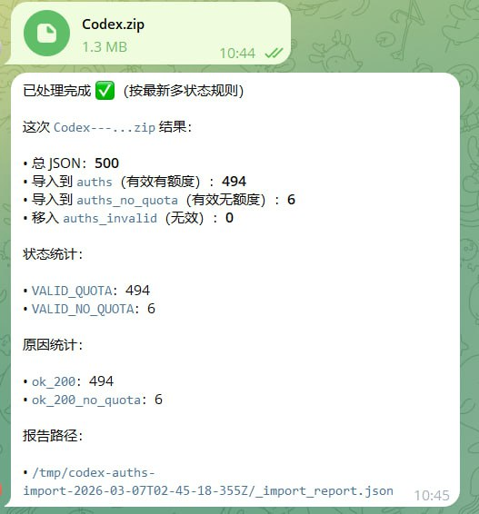
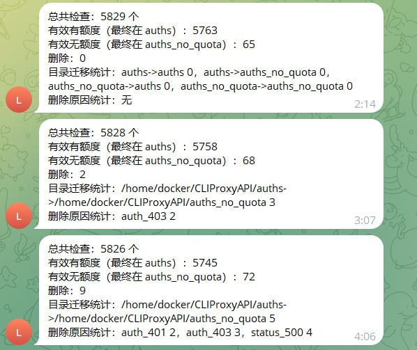

# skills-codex-auths-validator

## 一键复制使用（OpenClaw）

> 下面这段可以直接复制给 OpenClaw，让它学习本 skill、立刻执行一次，并创建全部定时任务。

```text
请安装并学习这个 skill：
https://github.com/LSH160981/skills-codex-auths-validator

要求你立即执行：
1) 拉取并学习 skills/codex-auths-validator 全部内容；
2) 自动探测（或让我指定）JSON 认证目录 auths_dir，并创建 auths_no_quota_dir 与 auths_invalid_dir；
3) 立刻执行一次全量校验与分层迁移；
4) 自动创建并启用全部定时任务（上海时区）：
   - 每小时自动校验清理（hourly-reconcile）
   - 每日 01:00（上海）GitHub 接口学习巡检
   - 每日 01:00（上海）Skill 同步
5) 把执行结果和创建的 cron job id 全部回报给我。
```

项目地址：`https://github.com/LSH160981/skills-codex-auths-validator`

中文（本文为主） | English: [README.en.md](./README.en.md)

---

## 中文

**OpenClaw 的 Codex 认证 JSON 自动化验证技能：每小时清理、ZIP/7z 导入校验、每日 GitHub 学习巡检。**

**只要告诉我 JSON 文件存放的目录，我就能自己工作。**

如果你不说目录：
- 默认视为可能安装了 `Cli-Proxy-API-Management-Center`
- 按源码线索（`auth-dir` + Docker 挂载）自动探测目录

### 核心能力（精简版）

1. 多 provider 自动识别（qwen/kimi/gemini/claude/codex/vertex/...）
2. codex 远程验证 + 统一状态体系
3. **三层过期检测**：JWT `exp` → `expired` 字段 → `last_refresh`+7天，过期不直接丢弃
4. **refresh_token 自动续期**：过期先尝试换新 token 并原子写回文件，救回可用账号
5. 双目录分层（有额度 / 无额度）+ 无效目录归档
6. **account_id 去重**：优先保留有额度的 account，自动移除冗余重复文件
7. ZIP/7z 导入自动接管（仅处理 JSON，非 JSON 忽略）
8. 每小时稳定巡检（并发锁 + 临时错误保留 + 自动去重 + report 自动清理）
9. 每日学习巡检 + 每日 skill 同步
10. **共享核心库 `lib/codex.mjs`**：三脚本统一复用（token 判断/续期/原子写/跨设备移动/安全列目录）

### 目录规则

- `auths_dir`：有效且有额度
- `auths_no_quota_dir`：有效但无额度/429
- `auths_invalid_dir`：无效文件（可解释原因，用户确认后可删）

### 四个脚本（谁做什么）

> 统一入口参数：三个脚本都支持 `--auth-dir <auths_dir>`（只给“有额度目录 auths”一个目录就能跑），会自动推导：
> - `<auths_dir>_no_quota` / `<auths_dir>_invalid` / `reports`（与 auths 同级）
> 仍可用 `--dir-quota/--dir-no-quota/--dir-invalid/--report-dir` 覆盖。

- `scripts/discover-auth-dir.mjs`：首次安装自动探测目录
- `scripts/validate-auths.mjs`：一次性人工批处理（支持 `--auth-dir`）
- `scripts/hourly-reconcile.mjs`：每小时定时稳定巡检（支持 `--auth-dir`）
- `scripts/import-archive.mjs`：ZIP/7z 导入接管（仅 JSON，支持 `--auth-dir`）

### 固定三项定时任务（上海时区）

1. **每小时自动校验清理（系统 crontab）**：`skills/codex-auths-validator/scripts/hourly-run-and-notify.sh`
   - 默认只需要配置一个目录：`AUTH_DIR=/path/to/auths`（不配则默认 `/home/docker/CLIProxyAPI/auths`）
   - 默认发精简摘要（从 `reports/hourly-reconcile-*.json` 读取关键统计，避免解析文本误判）
   - 若有额/无额两个目录都为空（以目录内 `*.json` 文件数判定）：仅发极简通知
   - **默认不发详细日志文件**（用户不想被刷屏）；仅当脚本异常（exit!=0）才会自动附详细日志文件。需要在无效/临时错误时也附日志可设置 `SEND_DETAIL=1`
2. **每日 01:00 GitHub 接口学习巡检**（OpenClaw cron，凌晨上海时间）
   - 精准追踪 6 个维度：认证API / Token续期接口 / Account字段 / provider枚举 / JSON schema / 状态码语义
   - 用 grep + GitHub API commits 对比上游变更，发现真实变化才更新 skill，不无中生有
   - 固定输出格式：每项明确说有/无变化 + commit hash
3. **每日 01:00 Skill 同步**（OpenClaw cron，可用 agentTurn）

### 关键状态（给用户解释"为什么无效"）

- `VALID_QUOTA`
- `VALID_NO_QUOTA`
- `INVALID_AUTH`
- `INVALID_EXPIRED`（三层过期判断后仍无法续期才丢弃；续期失败会继续 API 校验，401 才判死）
- `INVALID_JSON`
- `INVALID_MISSING_FIELDS`
- `INVALID_APPLEDOUBLE`
- `INVALID_DUPLICATE`（account_id 重复，优先保留有额度的）
- `SCHEMA_VALID_PROVIDER`
- `TRANSIENT_KEEP`
- reason=`refreshed`（token 续期成功，hourly summary 里有 `refreshedCount`）

### 运行截图（真实执行）

> 以下为技能真实运行截图（用户环境实拍）：

#### 图1：ZIP 导入后分层结果



#### 图2：每小时巡检结果示例




### 版本演进

- 从 codex 单类型校验，扩展到多 provider 自动识别
- 从直接删除，升级为无效目录归档 + 询问用户是否删除
- 从手动导入，升级为 ZIP/7z 自动接管与分层
- 修复每小时任务波动（并发锁 + 临时错误保留）
- **新增三层JWT过期检测**：JWT `exp` → `expired` 字段 → `last_refresh`+7天
- **新增 refresh_token 自动续期**：续期成功原子写回文件，救回可用账号
- **account_id 去重**：优先保留有额度账号
- **reports 目录自动清理**：默认保留最近 72 个
- **定时通知改系统 crontab**：不依赖 OpenClaw cron，最稳定
- **共享库 `lib/codex.mjs`**：消除三脚本重复逻辑；跨设备移动/原子写/安全列目录统一处理
- **非 codex 文件不再误入 invalid**：hourly 与 validate-auths 行为一致，schema 有效则保留
- **TG 消息自动分片**：超 4000 字符改发文件，不再被截断
- **摘要新增续期数/去重数**：`refreshedCount` / `dedupRemoved` 写入 report 并展示
- **学习巡检规则升级**：精准追踪 6 个接口维度（认证API/Token续期/Account/provider枚举/schema/状态码），凌晨 01:00（上海）运行，固定输出格式
- **自动清理 writeJsonAtomic 垃圾文件**：清理 `.*.tmp-PID-TS` 遗留文件，避免目录长期污染
- **reports 清理更稳定**：按文件名（时间戳）排序，不再依赖 mtime

